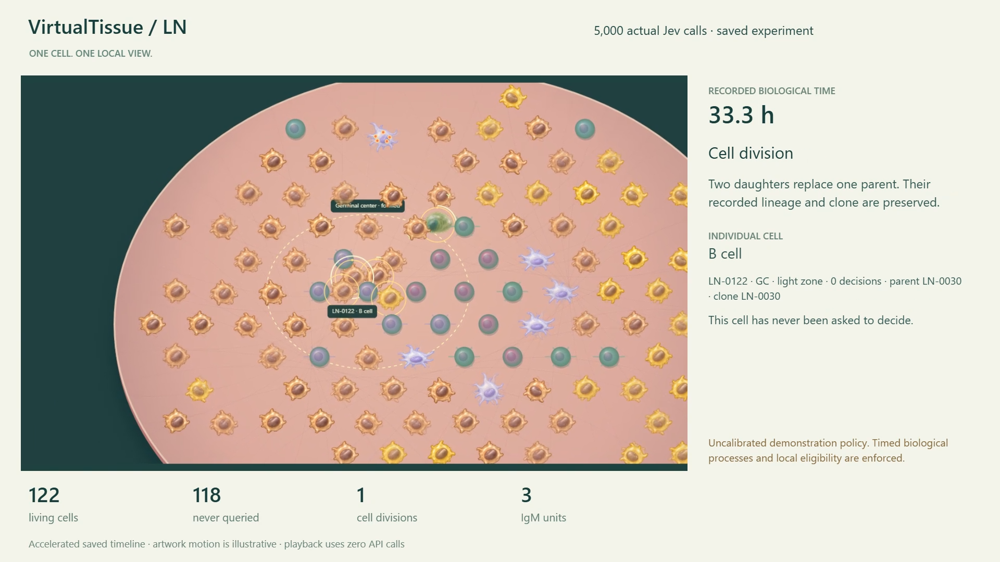

# VirtualTissue-LN · Lymph Node Studio

An independent lymph-node simulator created for Helder Nakaya.

The current [reviewed 5,000-call Jev recording](docs/CONTINUOUS_RESULTS.md)
shows DC entry, linked helper contact, one physical division, plasmablast/plasma
differentiation, IgM output and failed GC selection. It is an uncalibrated
demonstration, with a complete inspectable timeline and a separate MP4 exporter.



[Public website packaging](docs/PUBLICATION.md) · [Continuous recording and replay](docs/CONTINUOUS_RECORDING.md) · [Gut repository](https://github.com/hylixinsights/VirtualTissue)

Clone `https://github.com/hylixinsights/VirtualTissue-LN.git` to develop the LN independently. Build its public, API-free player with `python3 scripts/build_site.py`.

 **No Gut code, configuration, credentials, or recordings are modified or imported at runtime.** The implementation is new; VirtualTissue supplied architectural lessons (individual decisions, a deterministic biological kernel, local sensing, complete provenance and offline playback).

This is a **working, uncalibrated mechanistic prototype**, not a predictive human lymph-node model. Read [the implementation scope](docs/IMPLEMENTATION.md) alongside the supplied [biological manual](docs/BIOLOGICAL_MANUAL.md).

## Record a run with your own Jev key

Install **Python 3.10 or newer**. No Python packages are required.

1. Open **Start Jev.cmd** on Windows or **Start Jev.command** on macOS.
2. Paste your own Jev key into the hidden terminal prompt. It stays in the local server process.
3. Enter your maximum **API calls per run**, for example `5000`.

The browser opens the 120-cell tissue and the recording starts. It continues after
division, differentiation and antibody output until the call budget is reached,
the response is exhausted, or a provider error stops it. **Stop & save** in the
browser, or Ctrl+C in the terminal, saves and stops after any in-flight requests.
Every new launch gets its own folder and call allowance. There is no hidden
ten-decision ceiling in recording mode, and opening the playback never calls Jev.

The default **Competing-fate demonstration** is explicitly uncalibrated; it uses
local cell state and a proposed affinity-annotation threshold to illustrate both
GC expansion and early antibody output. Choose `--policy local` to remove that
demonstration preference. Biological outcomes are not guaranteed.

For terminals on Windows, macOS or Linux:

```sh
python scripts/start_jev.py --max-requests 5000
```

You can instead configure `TYPESAFE_API_KEY` and `JEV_MODEL` in the ignored local
`.env`, using `.env.example` as the template. Never put a key into website code.
Only the Python server connects to Jev. The static website needs no key at all.

[Recording, replay, and website packaging](docs/CONTINUOUS_RECORDING.md)

## Open the live, locally responding LN

Open **Start Lymph Node.cmd** on Windows or **Start Lymph Node.command** on macOS.
The default Studio is now the live reactive model, with **120 quiet resident cells**.
Choose **Introduce DC →** to apply the displayed English prompt and start the response.
The prompt adds one antigen-bearing dendritic cell at the afferent boundary; it does
not tell the resident cells what fate to take. Pause, step, change speed, focus the
response, or select any individual to inspect its own local cue and decision receipt.

```sh
python3 server.py --port 8010 --cells 120
```

Open http://127.0.0.1:8010. Initial populations range from 100 to 149, leaving room
for the arriving cell within the 150-cell safety limit. Quiet cells receive **no
question and no synthetic WAIT decision**. Local antigen, compatible neighboring
presentation, acquired programs and debris can wake a cell. Movement and other
processes advance on clocks between decisions. The supplied B, CD4 and DC artwork
represents those same individual agents; green artwork marks actual plasmablasts.

The default **Local policy preview** uses an explicitly deterministic, uncalibrated
policy and makes zero AI calls. This is a live simulation, not the earlier scripted
vaccine movie. See [local-response mechanics and limitations](docs/REACTIVE_LN.md).

**Start Jev.cmd** now starts the continuous recorder described above. The earlier
manual ten-decision preview is available with `python scripts/start_jev.py --preview`.
Quiet steps make no requests in either mode.

The previous engine, 100/300-cell UI and recordings remain available with:

```sh
python3 server.py --mode legacy --port 8014 --cells 100
```

The separate `/web/vaccine-demo.html` is an earlier **scripted** educational movie.
It is retained for comparison and does not represent the new activation scheduler.

## Use Jev for individual cell decisions

The [22 September reactive IgM result](docs/REACTIVE_JEV_IGM.md) records real Jev
choices leading to plasmablast secretion at 12 modeled hours, with an explicitly
declared high conditional output preference. Both attempts used 203 of the
authorized 50,000 API calls. The saved result can be opened without inference:

```sh
python scripts/run_reactive_jev.py --view --output recordings/private/reactive-jev-igm-guided --port 8018
```

For a strictly bounded **design preview of ten individual decisions**, run
`python scripts/design_preview.py --run` once with this project's key configured.
It sends one request for a stable sample of B, CD4 and cDC2 cells in the 100-cell
scene, saves the audit under ignored `recordings/private/design-preview-10`, and
opens a read-only local server at http://127.0.0.1:8012. Open that URL to inspect
each choice and compare **Before / After Jev**. Restart the viewer with
`python scripts/design_preview.py` (without `--run`); this makes no API calls.
An existing receipt, including a failed attempt, cannot be overwritten by the
runner. It never retries automatically. This applies a **partial 30-minute tick**
using the existing kernel: only the ten sampled cells receive choices, while
mandatory tissue clocks/antigen transport advance once. Other cells receive no
fixture substitute. This explicitly labeled design preview is not a complete
scientific round and cannot continue as an experiment.

The Windows launcher uses `scripts/start_jev.py`. It keeps the key in the server
process (or reads this project's existing `.env`) and never writes it to browser
storage or passes it as a command-line argument. The request cap is not a dollar
budget. Live inference requires your own configured credentials and explicit
request allowance; the illustration gallery and recordings do not require them.

The default live preview is explicitly labeled **Local policy preview**, with no AI inference. The separate legacy studio uses **Demo fixture**. Live Jev is never silently substituted for, or by, either preview. Automated tests use synthetic responses. Real recordings are identified by their provider audit.

The macOS **Start Jev.command** uses the same hidden-key, per-run-budget recorder as Windows. Use `--preview` for the earlier interactive ten-decision design preview.

For terminal use, configure `TYPESAFE_API_KEY` in the process environment, or copy `.env.example` to `.env` in **this folder** and fill it locally. Never put a key in a URL, browser form, recording or command-line argument. Then:

```sh
python3 server.py --port 8010 --provider jev --enable-jev --max-requests 1 --max-decisions 10
```

In legacy mode only, each live, non-busy cell gets an individual Choice question containing only its local observation and legal action menu. Up to 20 independent questions share a request, so an initial 100-cell round uses 5 requests and a 300-cell round uses 15. A busy cell completes its scheduled physical process without an additional decision. The server checks that the budget can cover a complete round before calling Jev. It performs no automatic retries and preserves usage from failed/partial batches. A failure pauses biological time; there is no fixture fallback. Request count is **not** a monetary or token budget.

The default pinned model is `jev-1.13.0`; `JEV_MODEL` can select another compatible version. Actual returned model identity, full decisions, distributions and known/unknown token usage are recorded. A model change mid-run is rejected.

## Biological routes and controls

- Afferent input → native-antigen capture → timed processing → peptide–HLA-II display.
- Local cognate DC–CD4 recognition with costimulation → border helper → local linked help to B cells.
- Helped B cells can choose an extrafollicular plasmablast branch or a timed GC founder program.
- Two qualified local founders plus a 120-minute organization interval initiate the proposed patch-scale GC. This threshold is a **P assumption**, not a human biological constant.
- Finite help licenses, physical space and timed cycles control division. Two daughters replace their parent; clone ancestry and antigen accounting persist.
- GC selection can lead to recycling, memory or plasma differentiation. Failed selection can cause apoptosis; local macrophages clear corpses separately.
- Plasma cells secrete their clone's antibody; memory cells do not. This version remains **IgM only**.

The five scenarios are protein antigen with adjuvant, quiet baseline, CD40–CD40L blockade, peptide–HLA mismatch, and FDC retention blockade. No button directly creates a germinal center.

## Earlier legacy recordings

**Export run** downloads a compressed `.ln.json.gz` episode with all decisions (not only visual samples), local observations, options, probability distributions, action receipts, complete event/antigen ledgers, ancestry, parameters, provenance and one visual frame per round. **Open recording** enables offline playback and seeking without simulating biology or calling Jev. The browser must use the local studio; it does not need external internet.

`recordings/demo-fixture.ln.json.gz` is a reproducible **fixture** example, seed 21, 45 simulated hours. It demonstrates GC formation, one physical division, memory and plasma output. It is not a Jev run or an experiment with predictive validity. Playback renders cell states; antigen-particle positions are retained in the final ledger, not every visual frame.

Legacy interactive runs stop at 120 rounds (60 simulated hours). The legacy recorder can explicitly extend a saved run to at most 480 rounds with `--resume --extend`, preserving the original decisions and auditing the duration/budget change. An emergency cap of twice the initial population invalidates a legacy run instead of deleting cells. Export before creating a new legacy run; closing that server without exporting loses its in-memory run. The current continuous recorder instead checkpoints automatically and uses the user's call allowance.

## Verification

```sh
python3 -m unittest discover -s tests -p 'test_*.py' -v
python3 tests/episodes.py
```

The first command tests biological invariants, negative gates, reproduction, antigen conservation, conflicts, timing, division ancestry, Jev schemas and budgets. The second generates the bundled fixture and checks all five full scenarios. All tests use synthetic responses, with no paid calls. `tests/browser.mjs` additionally tests the real WebGL interface using Playwright and installed Chrome; set `PLAYWRIGHT_MODULE` if needed.

See [verification results](docs/VERIFICATION.md), [parameter/contract snapshot](docs/model-contract.json), and [source provenance](docs/sources.json).

## Credits

Concept and biological direction: **Helder Nakaya**, CSBL / Hylix.app. Implementation: Codex, as an AI collaborator. Architectural reference: [hylixinsights/VirtualTissue](https://github.com/hylixinsights/VirtualTissue). Biological specification: the supplied *Lymph Node Simulation Biological Manual*, v1.0, 21 September 2026. Decision service: [TypeSafe / Jev](https://docs.typesafe.ai/api). Graphics: Three.js 0.180.0, MIT; license included in `vendor/THREE-LICENSE.txt`. No project-wide license has been assigned by the owner.

## Earlier legacy Jev recorder

The real recorder never calls `Simulation.fixture`. With this project's key configured, choose an explicit total request limit, for example:

```sh
python3 scripts/record_jev.py --cells 100 --scenarios vaccine --max-requests 450 --rounds 90 --workers 4
```

This requests one 45-hour antigen/adjuvant scenario with 100 initial cells and a hard total cap of 450 HTTP attempts. More cells, failures or additional batches may make the recording partial; busy cells reduce calls. Other scenarios can be selected explicitly. This is a real paid run.

At most four HTTP requests are in flight at once. A failed wave prevents later batches from starting; there are no automatic retries. Before each request, an append-only journal records the attempt. Returned answers and usage are persisted; each completed physical round records its frame and execution receipts. Compressed playback files are saved every five rounds, on completion, and on a handled interruption/failure. A partial round stores its pending local observations and paid response audit without applying incomplete proposals.

Files are saved under `recordings/private/jev-<timestamp>-<id>/`, ignored by Git. `summary.json` reports scenario completion and actual request/token usage. `audit.jsonl` preserves incremental provenance. The browser's **Saved Jev examples** menu lists these recordings, and its playback badge distinguishes actual Jev responses from fixtures. Playing or inspecting a recording makes no inference calls. Recordings preserve whichever biological outcome actually happened; a GC or antibody response is not guaranteed by a real Jev policy.

Authentication of the supplied project key was checked on 21 September 2026 using the read-only model catalogue; this check performed zero inference requests. The suite then passed 47 synthetic tests, including recorder, concurrency, compact-population, precision and resume checks. These tests do not establish the quality of paid Jev decisions.


### Protocol audit and explicit continuation

Small discrepancies in two-decimal Jev probabilities are normalized only inside the round-to-nearest bound of 0.005 per option. Raw probabilities, original sums and corrections are retained; the selected action must remain the maximum. Larger or otherwise invalid distributions pause the run. These are decision preferences, not biological transition rates.

Prompt v2 represents repeated local entities as lossless columns/rows tables. No cell gains remote information and no local facts are dropped. Each request has a prompt hash/version; early v1 requests remain identifiable.

After a reviewed failure, `--resume --output recordings/private/<session>` reconstructs the recorded kernel state, verifies exact agreement and reuses matching paid responses before sending missing requests. The original seed, population, model, target rounds and total request cap must match. This is an explicit operator action, never an automatic retry. HTTP failures retain unknown usage unless the provider reports it.


Actual 100-cell recording: [results, measured usage and protocol limitations](docs/LIVE_RUN.md). The saved episode contains 44.5 simulated hours and 8,463 real Jev decisions; it is marked partial because the request cap prevented the final target round.


### Extended demonstration

`--stop-on-demo` ends a real recording after an observed physical division and at least one memory B cell or mature plasma cell. This selects the recording endpoint, not cellular actions. `--biological-context` selects prompt v3, which explains the implemented state names and finite licenses (`docs/jev-model-semantics.json`). It changes the Jev decision context and is recorded at its activation round. Kernel gates, clocks and antigen inventory remain unchanged.

The 21 September extended example uses a cumulative 1,800-attempt cap including prior attempts. With the documented 64k request context and US$0.042/M input-token price, reserving 65,536 input tokens for every attempt yields an upper estimate of US$4.9545216, below the user's US$5 allowance. Output is free. This bound is specific to the pinned model and verified current tariff, not a general future price guarantee.


The completed [64-hour demonstration](docs/DEMONSTRATION.md) contains one division and three memory B cells, with a proposed competing-fate rubric explicitly introduced at 60 h. All applied choices are real Jev responses. Its comparison history and cumulative costs are documented; this is a demonstration, not an unbiased biological validation.
